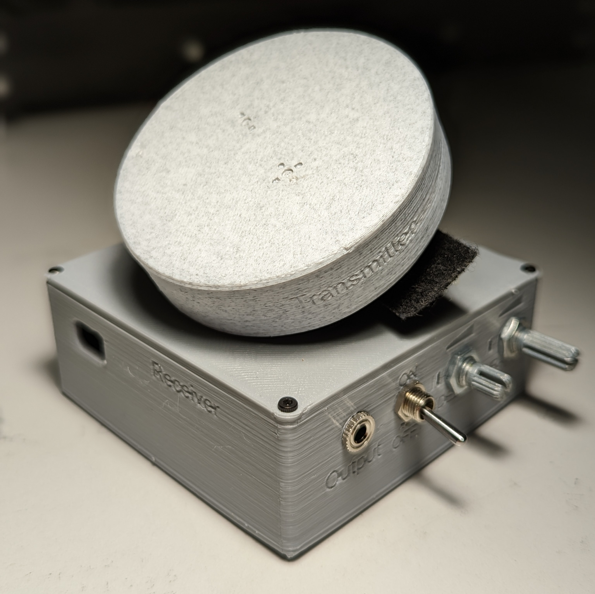

# Wearable Clap Switch

The Wearable Clap Switch is a wireless assistive switch designed for users that have difficulty using traditional pressure based switches. It consists of a hand mounted transmitter, and a receiver box. When the transmitter detects a clap motion, it sends a signal to the receiver which activates the mono jack. The receiver can be used to activate an 3.5 mm assistive device like a switch adapted toy.

The original version of this project is called the Wearable Bluetooth Controller for Switch Adapted Toys. It was released by [r570sv](https://www.instructables.com/member/r570sv/) on [Instructables](https://www.instructables.com/Wearable-BLE-Controller-for-Switch-Adapted-Toys/) under a [CC-BY-NC-SA license](https://creativecommons.org/licenses/by-nc-sa/4.0/).

## More info at
- [Makers Making Change Project Page](https://makersmakingchange.com/project/wearable-clap-switch)

## How to Obtain a Wearable Clap Switch
### 1. Do it Yourself (DIY) or Do it Together (DIT)

This is an open-source assistive technology, so anyone is free to build it. All of the files and instructions required to build the Wearable Clap Switch are contained within this repository. Refer to the Maker Checklist below.

### 2. Request a build of this device

If you would like to obtain a Wearable Clap Switch , you may submit a build request through the [MMC Library Page](https://makersmakingchange.com/project/wearable-clap-switch/). The requestor is responsible for the cost of materials and any shipping.

### 3. How to build this device for someone else

If you have the skills and equipment to build this device, and would like to donate your time to create the switch for someone who needs it, visit the [MMC Maker Wanted](https://makersmakingchange.com/maker-wanted/) section.

## Getting Started

### 1. Read the Makers Checklist

The Makers Checklist contains all the steps required to build the device for someone.

### 2. Order the Off-The-Shelf Components

The [Bill of Materials](/Documentation/Wearable_Clap_Switch_BOM.xlsx) lists all of the parts and components required to build the Wearable Clap Switch. The main switch component needs to be ordered online. The rest of the off-the-shelf components are also online or may be available in smaller quantities at your local hardware store or dollar store.

### 3. Print the 3D Printable components

Print the components. All of the files and individual print files can be in the [/Build_Files/3D_Printing_Files](/Build_Files/3D_Printing_Files/) folder.

### 4. Assemble the Wearable Clap Switch

Reference the [Assembly Guide](/Documentation/Wearable_Clap_Switch_Assembly_Guide_V1.0.pdf) for the tools and steps required to build each portion.

## Files
### Documentation
| Document             | Version | Link |
|----------------------|---------|------|
| Design Rationale     | 1.0     | [Wearable_Clap_Switch_Design_Rationale](/Documentation/Wearable_Clap_Switch_Design_Rationale_v1.0.pdf)     |
| Maker Checklist      | 1.0     | [Wearable_Clap_Switch_Maker_Checklist](/Documentation/Wearable_Clap_Switch_Maker_Checklist_v1.0.pdf)     |
| Bill of Materials    | 1.0     | [Wearable_Clap_Switch_Bill_of_Materials](/Documentation/Wearable_Clap_Switch_BOM_v1.0.xlsx)     |
| 3D Printing Guide    | 1.0     | [Wearable_Clap_Switch_3D_Printing_Guide](/Documentation/Wearable_Clap_Switch_3D_Printing_Guide_v1.0.pdf)     |
| Assembly Guide       | 1.0     | [Wearable_Clap_Switch_Assembly_Guide](/Documentation/Wearable_Clap_Switch_Assembly_Guide_v1.0.pdf)     |
| User Guide           | 1.0     | [Wearable_Clap_Switch_User_Guide](/Documentation/Wearable_Clap_Switch_User_Guide_v1.0.pdf)    |
| Changelog            | 1.0     | [Wearable_Clap_Switch_Changelog](/Documentation/Wearable_Clap_Switch_Changelog_v1.0.pdf)     |

### Design Files
 - [CAD Files](/Build_Files/Design_Files)

### Build Files
 - [3D Printing Files](/Build_Files/3D_Printing)

### Programming Files
 - [Programming Files](/Code/Current_Code)

## Attribution
The original design of the [Wearable Bluetooth Controller for Switch Adapted Toys](https://www.instructables.com/Wearable-BLE-Controller-for-Switch-Adapted-Toys/) was released by [r570sv](https://www.instructables.com/member/r570sv/) under a [CC-BY-NC-SA license](https://creativecommons.org/licenses/by-nc-sa/4.0/).

Updated 3D Printed Receiver Design, code, and documentation by Brad Wellington / Makers Making Change.

## License
Everything needed or used to design, make, test, or prepare the Wearable Clap Switch is licensed under the [Creative Commons Attribution-NonCommercial-ShareAlike 4.0](https://creativecommons.org/licenses/by-nc-sa/4.0/) . 

Accompanying material such as instruction manuals, videos, and other copyrightable works that are useful but not necessary to design, make, test, or prepare the Wearable Clap Switch are published under a Creative Commons Attribution-ShareAlike 4.0 license https://creativecommons.org/licenses/by-sa/4.0/ (CC BY-SA 4.0).

---
<!-- ABOUT MMC START -->
## About Makers Making Change

Makers Making Change is an initiative of [Neil Squire](https://www.neilsquire.ca/), a Canadian non-profit that helps people with disabilities.

We are committed to creating a network of volunteer makers who support people with disabilities in their communities through 3D printing assistive devices. Check out our library of free, open-source assistive technologies with parts and build instructions.

 - Website: [www.MakersMakingChange.com](https://www.makersmakingchange.com/)
 - GitHub: [https://github.com/makersmakingchange](https://github.com/makersmakingchange)
 - Twitter: [@makermakechange](https://twitter.com/makermakechange)
 - Instagram: [@makersmakingchange](https://www.instagram.com/makersmakingchange)

## Contact Us

For technical questions, to get involved, or share your experience we encourage you to visit the [MMC Website](https://www.makersmakingchange.com/), [MMC Forum](https://makersmakingchange.com/forum), or contact info@makersmakingchange.com
<!-- ABOUT MMC END -->
